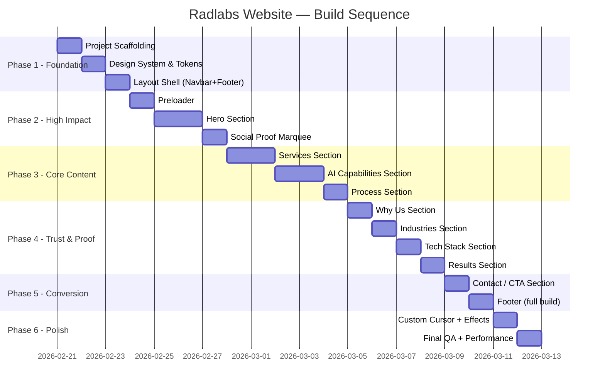

# RADLABS TECHNOLOGIES — Master Build Plan
## Page-by-Page, Module-by-Module Implementation Blueprint

> **Philosophy**: We do NOT build the entire product at once. We build **one page at a time**, verify it, then move to the next. Each phase is self-contained and shippable.

---

# BUILD PHASES OVERVIEW



---

# PHASE 1 — FOUNDATION

> **Goal**: Scaffold the project, establish the design system, and create the persistent layout shell. No visible "page" yet — just the skeleton that everything mounts into.

---

## Page 1.1: Project Scaffolding

### What We Build
Initialize the Next.js 14+ project with App Router, install all dependencies, configure TypeScript, ESLint, Prettier, and Tailwind.

### Modules

#### Module 1.1.1 — Next.js Project Init
| Item | Detail |
|------|--------|
| Action | `npx -y create-next-app@latest ./ --typescript --tailwind --eslint --app --src-dir=false --import-alias="@/*"` |
| Output | Working Next.js skeleton with App Router |

#### Module 1.1.2 — Dependency Installation
```bash
npm install gsap @gsap/react lenis clsx framer-motion
npm install -D @types/node prettier eslint-config-prettier
```

#### Module 1.1.3 — TypeScript Config
- Strict mode enabled (`"strict": true`)
- Path aliases (`@/components/*`, `@/lib/*`, `@/hooks/*`, `@/types/*`)
- No implicit any

#### Module 1.1.4 — ESLint + Prettier Config
- Extend Next.js recommended + Prettier
- Rules: no unused vars (error), no `any` (error), no console (warn)
- `.prettierrc`: single quotes, trailing commas, 100 print width, 2-space indent

#### Module 1.1.5 — Folder Structure Creation
Create all directories as defined in `ruleengine.md` Section 3:
```
components/{layout,sections,ui,effects}/
hooks/
lib/
types/
public/fonts/
__tests__/
```

### Files Created/Modified
| File | Action | Purpose |
|------|--------|---------|
| `package.json` | Modified | Dependencies added |
| `tsconfig.json` | Modified | Strict mode, path aliases |
| `.eslintrc.json` | Modified | Extended rules |
| `.prettierrc` | New | Formatting config |
| All directories | New | Project structure skeleton |

### Definition of Done
- [ ] `npm run dev` starts without errors
- [ ] `npx tsc --noEmit` passes with zero errors
- [ ] All folders exist
- [ ] Path aliases resolve correctly

---

## Page 1.2: Design System & Tokens

### What We Build
The complete visual foundation — CSS custom properties, Tailwind theme extensions, font loading, and utility functions. This is the DNA that every component inherits.

### Modules

#### Module 1.2.1 — CSS Custom Properties (`globals.css`)
Define all brand colors, functional colors, glow values, spacing tokens exactly as specified in `product.md` Section 1.2:
```css
:root {
  /* Core Darks */
  --bg-void: #050505;
  --bg-surface: #0A0A0A;
  --bg-elevated: #111111;
  --bg-card: #1A1A1A;

  /* Radlabs Fire (Primary Accent) */
  --fire-deep: #6B0F0F;
  --fire-core: #8B1A1A;
  --fire-brand: #C62828;
  --fire-bright: #E53935;
  --fire-neon: #FF1744;

  /* Text Hierarchy */
  --text-primary: #F5E6D3;
  --text-secondary: #B0A090;
  --text-muted: #6B6B6B;
  --text-white: #FFFFFF;

  /* Functional */
  --glow-red: rgba(255, 23, 68, 0.4);
  --glow-red-soft: rgba(198, 40, 40, 0.15);
  --border-subtle: rgba(255, 255, 255, 0.06);
  --border-red: rgba(198, 40, 40, 0.3);
}
```
Plus: CSS reset, base body styles (`bg-void`, `text-secondary`, `antialiased`), selection color, scrollbar styling.

#### Module 1.2.2 — Tailwind Theme Extension (`tailwind.config.ts`)
Map every CSS variable into Tailwind's theme so we can use classes like `bg-fire-brand`, `text-text-primary`, `border-border-red`, `shadow-glow-red`:
```typescript
// tailwind.config.ts — extend colors, boxShadow, fontFamily, screens
extend: {
  colors: {
    'bg-void': 'var(--bg-void)',
    'fire-brand': 'var(--fire-brand)',
    // ... all tokens
  },
  boxShadow: {
    'glow-red': '0 0 30px var(--glow-red-soft)',
    'glow-red-intense': '0 0 40px var(--glow-red)',
  },
  fontFamily: {
    serif: ['Instrument Serif', 'Playfair Display', 'serif'],
    grotesk: ['Space Grotesk', 'sans-serif'],
    mono: ['IBM Plex Mono', 'JetBrains Mono', 'monospace'],
  },
  screens: {
    mobile: '375px',
    tablet: '768px',
    laptop: '1024px',
    desktop: '1440px',
  },
}
```

#### Module 1.2.3 — Font Loading (`lib/fonts.ts`)
Use `next/font/google` for optimal loading:
```typescript
import { Space_Grotesk, IBM_Plex_Mono, JetBrains_Mono } from 'next/font/google';
import localFont from 'next/font/local';

export const spaceGrotesk = Space_Grotesk({ subsets: ['latin'], variable: '--font-grotesk' });
export const ibmPlexMono = IBM_Plex_Mono({ weight: ['400', '500'], subsets: ['latin'], variable: '--font-mono' });
export const instrumentSerif = localFont({ src: '../public/fonts/InstrumentSerif-Italic.woff2', variable: '--font-serif' });
```

#### Module 1.2.4 — Utility Functions (`lib/utils.ts`)
```typescript
// cn() — Tailwind class merger
export function cn(...inputs: ClassValue[]): string;

// splitText() — Split text into spans for animation
export function splitTextToSpans(text: string): React.ReactNode[];

// formatNumber() — Animate-friendly number formatting
export function formatNumber(value: number, suffix?: string): string;
```

#### Module 1.2.5 — TypeScript Types (`types/index.ts`)
```typescript
// ---- Domain Entities (backend-ready shapes) ----

export interface ServiceItem {
  readonly id: string;            // e.g. 'svc_001'
  readonly slug: string;          // e.g. 'artificial-intelligence'
  readonly title: string;
  readonly shortDescription: string;
  readonly fullDescription: string;
  readonly icon: string;          // Lucide icon name
  readonly tags: readonly string[];
  readonly displayOrder: number;
  readonly isActive: boolean;
  readonly metadata: {
    readonly estimatedDelivery: string;
    readonly startingPrice: number | null; // null = "Contact us"
  };
  readonly createdAt: string;     // ISO 8601
  readonly updatedAt: string;
}

export interface CapabilityItem {
  readonly id: string;            // e.g. 'cap_001'
  readonly slug: string;
  readonly title: string;
  readonly description: string;
  readonly icon: string;
  readonly displayOrder: number;
  readonly isActive: boolean;
  readonly createdAt: string;
  readonly updatedAt: string;
}

export interface FeatureBadge {
  readonly id: string;            // e.g. 'feat_001'
  readonly label: string;
  readonly icon: string;
  readonly displayOrder: number;
}

export interface ProcessStep {
  readonly id: string;            // e.g. 'prc_001'
  readonly slug: string;
  readonly phase: string;         // '01', '02', etc.
  readonly title: string;
  readonly description: string;
  readonly displayOrder: number;
  readonly isActive: boolean;
  readonly createdAt: string;
  readonly updatedAt: string;
}

export interface ValueProposition {
  readonly id: string;            // e.g. 'val_001'
  readonly slug: string;
  readonly title: string;
  readonly description: string;
  readonly icon: string;
  readonly displayOrder: number;
  readonly isActive: boolean;
  readonly createdAt: string;
  readonly updatedAt: string;
}

export interface IndustryItem {
  readonly id: string;            // e.g. 'ind_001'
  readonly slug: string;
  readonly title: string;
  readonly description: string;
  readonly icon: string;
  readonly imageUrl: string;      // Generated image path
  readonly imageAlt: string;
  readonly displayOrder: number;
  readonly isActive: boolean;
  readonly createdAt: string;
  readonly updatedAt: string;
}

export interface TechCategory {
  readonly id: string;            // e.g. 'tch_001'
  readonly slug: string;
  readonly category: string;
  readonly technologies: readonly TechItem[];
  readonly displayOrder: number;
  readonly isActive: boolean;
  readonly createdAt: string;
  readonly updatedAt: string;
}

export interface TechItem {
  readonly id: string;            // e.g. 'tech_001'
  readonly name: string;
  readonly slug: string;
  readonly logoUrl: string | null;
  readonly websiteUrl: string;
}

export interface MetricItem {
  readonly id: string;            // e.g. 'mtr_001'
  readonly slug: string;
  readonly value: string;         // '40%', '3x', '100%'
  readonly numericValue: number;  // 40, 3, 100 — for counter animation
  readonly suffix: string;        // '%', 'x', '%'
  readonly label: string;
  readonly description: string;
  readonly displayOrder: number;
  readonly isActive: boolean;
  readonly createdAt: string;
  readonly updatedAt: string;
}

export interface SocialProofItem {
  readonly id: string;            // e.g. 'spr_001'
  readonly text: string;
  readonly displayOrder: number;
}

export interface ContactInfo {
  readonly id: string;            // e.g. 'cnt_001'
  readonly type: 'email' | 'phone' | 'website' | 'address';
  readonly label: string;
  readonly value: string;
  readonly href: string;
  readonly displayOrder: number;
}

export interface NavLink {
  readonly id: string;            // e.g. 'nav_001'
  readonly label: string;
  readonly href: string;
  readonly displayOrder: number;
  readonly isActive: boolean;
}

export interface CompanyInfo {
  readonly name: string;
  readonly tagline: string;
  readonly extendedTagline: string;
  readonly mission: string;
  readonly website: string;
  readonly email: string;
  readonly phones: readonly string[];
  readonly headquarters: string;
  readonly socialLinks: readonly SocialLink[];
  readonly copyright: string;
}

export interface SocialLink {
  readonly id: string;
  readonly platform: string;
  readonly url: string;
  readonly icon: string;
}

export interface HeroContent {
  readonly preHeadline: string;
  readonly headline: string;
  readonly highlightWords: readonly string[];
  readonly pills: readonly string[];
  readonly primaryCta: CtaButton;
  readonly secondaryCta: CtaButton;
}

export interface CtaButton {
  readonly id: string;
  readonly label: string;
  readonly href: string;
  readonly variant: 'primary' | 'secondary' | 'ghost';
}
```

#### Module 1.2.6 — API Response Types (`types/api.ts`)
```typescript
// Generic API response envelope — matches standard REST patterns
export interface ApiResponse<T> {
  data: T;
  meta: {
    total: number;
    page: number;
    perPage: number;
    timestamp: string;
  };
  status: 'success' | 'error';
}

export interface ApiSingleResponse<T> {
  data: T;
  status: 'success' | 'error';
}

export interface ApiErrorResponse {
  error: {
    code: string;
    message: string;
    details?: Record<string, string[]>;
  };
  status: 'error';
}
```

#### Module 1.2.7 — Mock Data Layer (`data/mock/*.ts`)
Create individual mock data files per domain entity. All mock data uses:
- Prefixed IDs (`svc_001`, `ind_002`)
- Slugs for future URL routing
- `displayOrder` for backend-sortable lists
- `isActive` for soft-delete
- ISO timestamps
- `as const` readonly arrays

Files to create:
| File | Contains | Entity Count |
|------|----------|--------------|
| `data/mock/services.ts` | 5 service items | 5 |
| `data/mock/capabilities.ts` | 4 capability items + 4 feature badges | 8 |
| `data/mock/process.ts` | 4 process steps | 4 |
| `data/mock/industries.ts` | 4 industry items | 4 |
| `data/mock/tech-stack.ts` | 6 categories with ~8 techs each | ~54 |
| `data/mock/metrics.ts` | 3 metric items + commitment text | 4 |
| `data/mock/navigation.ts` | 6 nav links + hero content | 7 |
| `data/mock/company.ts` | Company info + 3 value props | 4 |
| `data/mock/social-proof.ts` | 4 social proof items | 4 |
| `data/mock/index.ts` | Barrel export | — |

#### Module 1.2.8 — Data Adapters (`data/adapters.ts`)
```typescript
// Transform API responses → component-ready data
// One adapter per entity type

export function adaptServices(response: ApiResponse<ServiceItem[]>): ServiceItem[];
export function adaptCapabilities(response: ApiResponse<CapabilityItem[]>): CapabilityItem[];
export function adaptIndustries(response: ApiResponse<IndustryItem[]>): IndustryItem[];
export function adaptTechStack(response: ApiResponse<TechCategory[]>): TechCategory[];
export function adaptMetrics(response: ApiResponse<MetricItem[]>): MetricItem[];

// Mock fetchers (swap these for real API calls later)
export function getMockServices(): ApiResponse<ServiceItem[]>;
export function getMockCapabilities(): ApiResponse<CapabilityItem[]>;
// ... etc.
```

> **Backend swap = ONE LINE per section:**
> ```diff
> - const response = getMockServices();
> + const response = await fetch('/api/services').then(r => r.json());
>   const services = adaptServices(response);
> ```

#### Module 1.2.9 — Content Constants (`lib/constants.ts`)
Static UI strings that are NOT entity data (animation timings, breakpoints, SEO metadata). Entity data lives in `data/mock/`.

### Files Created/Modified
| File | Action |
|------|--------|
| `app/globals.css` | Overwrite — full design system CSS |
| `tailwind.config.ts` | Modified — extended theme |
| `lib/fonts.ts` | New |
| `lib/utils.ts` | New |
| `lib/constants.ts` | New |
| `types/index.ts` | New |

### Definition of Done
- [ ] All Tailwind classes resolve to correct brand colors
- [ ] Fonts load correctly in the browser
- [ ] `cn()` merges classes without conflicts
- [ ] All content types are defined and exported
- [ ] All mock data files created with realistic content
- [ ] Adapters compile and return correctly shaped data
- [ ] `npm run build` passes

---

## Page 1.3: Layout Shell

### What We Build
The root layout, the Lenis smooth scroll provider, and placeholder Navbar + Footer that persist across the scroll experience.

### Modules

#### Module 1.3.1 — Root Layout (`app/layout.tsx`)
- Apply font variables to `<html>` element
- Set metadata (title, description, OpenGraph, Twitter Cards)
- Wrap children in `<SmoothScroll>` provider
- Add Schema.org structured data (`Organization`, `Service`)
- `<body>` classes: `bg-bg-void text-text-secondary antialiased`

#### Module 1.3.2 — Smooth Scroll Provider (`components/layout/SmoothScroll.tsx`)
```typescript
'use client';
// Initialize Lenis with GSAP ScrollTrigger integration
// Duration: 1.2, easing: exponential decay
// Register GSAP plugins: ScrollTrigger
// Connect lenis.raf to gsap.ticker
```

#### Module 1.3.3 — Navbar Skeleton (`components/layout/Navbar.tsx`)
Static structure only (animations added in Phase 2):
- Fixed position, full-width, `backdrop-filter: blur(12px)`
- Logo left (40px), nav links center, CTA button right
- Mobile: hamburger icon (full-screen overlay deferred to Phase 6)
- Links: Services, Capabilities, Industries, Stack, Results, Contact

#### Module 1.3.4 — Footer Skeleton (`components/layout/Footer.tsx`)
Static structure only:
- Logo (80px) + tagline left
- Quick links center
- CTA + email right
- Copyright bar bottom

#### Module 1.3.5 — Main Page Composition (`app/page.tsx`)
```typescript
export default function Home() {
  return (
    <main>
      {/* Sections will be added one by one in subsequent phases */}
      {/* <Hero /> */}
      {/* <SocialProof /> */}
      {/* ... */}
    </main>
  );
}
```

### Files Created/Modified
| File | Action |
|------|--------|
| `app/layout.tsx` | Overwrite — root layout with fonts, metadata, providers |
| `app/page.tsx` | Overwrite — main page with section slots |
| `components/layout/SmoothScroll.tsx` | New |
| `components/layout/Navbar.tsx` | New |
| `components/layout/Footer.tsx` | New |

### Definition of Done
- [ ] Page loads with dark background, correct fonts, smooth scrolling
- [ ] Navbar is visible and fixed at top with blur effect
- [ ] Footer renders at the bottom
- [ ] `npm run build` passes
- [ ] Lenis smooth scroll is active

---

# PHASE 2 — HIGH IMPACT SECTIONS

> **Goal**: Build the first three things the user sees — the preloader, the hero, and the social proof bar. These carry the highest visual weight and set the tone for the entire experience.

---

## Page 2.1: Preloader

### What We Build
A cinematic loading screen that plays once per session, featuring the Radlabs flame logo with a pulsing red glow, letter-by-letter text reveal, and a progress bar.

### Mock Data Used
Preloader uses static content from `lib/constants.ts` (brand name "RADLABS") — no entity data.

### Modules

#### Module 2.1.1 — Preloader Component (`app/loading.tsx` + `components/sections/Preloader.tsx`)
- Black screen, centered flame logo with `box-shadow: 0 0 60px var(--glow-red)` pulsing via `@keyframes`
- "RADLABS" text: each letter fades in sequentially (custom `splitTextToSpans` + CSS animation or GSAP)
- Thin neon red progress bar at bottom: grows `width: 0% → 100%` over 1.5s
- On complete: entire preloader slides up (`translateY(-100%)`) with `power4.inOut` ease
- **Session check**: Use `sessionStorage.setItem('radlabs-loaded', 'true')` — skip preloader on subsequent navigations within the same session

#### Module 2.1.2 — Preloader Animation Logic
```typescript
// Timeline:
// 0.0s → Logo appears with glow pulse
// 0.3s → Letters start revealing (0.08s stagger each)
// 0.0s → Progress bar starts growing (1.5s total)
// 1.5s → Brief hold (0.3s)
// 1.8s → Screen wipes up, hero content fades in
```

### Files Created/Modified
| File | Action |
|------|--------|
| `components/sections/Preloader.tsx` | New |
| `app/page.tsx` | Modified — add Preloader |

### Definition of Done
- [ ] Preloader plays on first visit
- [ ] Preloader is skipped on page refresh within same session
- [ ] Logo glow pulses smoothly
- [ ] Letters reveal sequentially
- [ ] Progress bar completes before exit animation
- [ ] Exit animation is smooth (no jank)
- [ ] `prefers-reduced-motion`: Preloader is instant (0ms), content shown immediately

---

## Page 2.2: Hero Section

### What We Build
The full-viewport hero — the most visually impactful section of the entire site. Layered backgrounds, animated headline, call-to-action buttons, and scroll indicator.

### Modules

#### Module 2.2.1 — Hero Container (`components/sections/Hero.tsx`)
- Full viewport height (`min-h-screen`), flexbox centered
- Z-layered backgrounds (void → mesh gradient → particles → grain)

#### Module 2.2.2 — Background Layer: Mesh Gradient
- CSS `@keyframes gradient-morph` — interpolating between deep red and black radial gradients
- Slow morph cycle (8-12s) for ambient motion
- Positioned absolutely behind content, `z-index: 0`

#### Module 2.2.3 — Background Layer: Particle Field (`components/effects/ParticleField.tsx`)
- `<canvas>` element, full viewport, `z-index: 1`
- ~20 small red/white particles drifting slowly
- Proximity lines: when two particles are within 150px, draw a faint connecting line (neural network aesthetic)
- **Performance**: Use `requestAnimationFrame`, pause when not in viewport
- **Mobile**: Disabled on screens < 768px for performance

#### Module 2.2.4 — Background Layer: Grain Overlay (`components/effects/GrainOverlay.tsx`)
- Full viewport `<div>` with CSS noise texture at 3-5% opacity
- `pointer-events: none`, `z-index: 2`
- Can use SVG filter (`feTurbulence`) or a tiled noise PNG

#### Module 2.2.5 — Hero Content

**Mock Data Source**: `data/mock/navigation.ts` → `HeroContent`
```typescript
// data/mock/navigation.ts (excerpt)
export const MOCK_HERO_CONTENT: HeroContent = {
  preHeadline: '[ AI PARTNERS. LIMITLESS VISION. ]',
  headline: 'Blending creativity,\nengineering & innovation\nto build intelligent solutions.',
  highlightWords: ['creativity', 'engineering', 'innovation'],
  pills: [
    'Evolve Faster',
    'Operate Smarter',
    'Stay Competitive',
    'Built for Tomorrow',
  ],
  primaryCta: {
    id: 'cta_001',
    label: "Let's Build Something Remarkable",
    href: '#contact',
    variant: 'primary',
  },
  secondaryCta: {
    id: 'cta_002',
    label: 'See Our Work \u2193',
    href: '#services',
    variant: 'ghost',
  },
};
```

- **Pre-headline label**: `[ AI PARTNERS. LIMITLESS VISION. ]`
  - Font: `JetBrains Mono`, uppercase, `var(--fire-neon)`, letter-spaced 0.15em
  - Animation: fade-in first (before headline)

- **Main headline (H1)**: Rendered from `heroContent.headline`
  - Font: `Instrument Serif` italic, 72px desktop / 36px mobile
  - Color: `var(--text-primary)` warm cream
  - Animation: SplitText — each word fades up + blur-to-sharp, 0.04s stagger
  - Keywords from `heroContent.highlightWords` flash `var(--fire-neon)` on appear

- **Sub-text pills**: Rendered from `heroContent.pills` array
  - Each: `border: 1px solid var(--border-red)`, staggered fade-in
  - Hover: fill with `var(--fire-deep)` background

- **CTA buttons**: Rendered from `heroContent.primaryCta` and `heroContent.secondaryCta`
  1. Primary: neon red glow, filled on hover
  2. Secondary: ghost button, smooth scroll to Services

- **Scroll indicator**: Animated chevron + "SCROLL" label, `position: absolute; bottom: 2rem`

#### Module 2.2.6 — UI Components Used
| Component | File | Purpose |
|-----------|------|---------|
| `Button` | `components/ui/Button.tsx` | Primary + Ghost variants with glow |
| `SectionHeader` | `components/ui/SectionHeader.tsx` | Reusable eyebrow + headline pattern |

### Files Created/Modified
| File | Action |
|------|--------|
| `components/sections/Hero.tsx` | New |
| `components/effects/ParticleField.tsx` | New |
| `components/effects/GrainOverlay.tsx` | New |
| `components/ui/Button.tsx` | New |
| `components/ui/SectionHeader.tsx` | New |
| `hooks/useReducedMotion.ts` | New |
| `hooks/useMediaQuery.ts` | New |
| `lib/animations.ts` | New — GSAP preset factories |
| `app/page.tsx` | Modified — uncomment Hero |

### Definition of Done
- [ ] Hero fills full viewport on all screen sizes
- [ ] Mesh gradient animates smoothly in background
- [ ] Particle field renders on desktop, hidden on mobile
- [ ] Grain overlay is visible but subtle
- [ ] Headline animates word-by-word with blur effect
- [ ] Keywords flash neon red on reveal
- [ ] Pills fade in with stagger
- [ ] Primary CTA has glow pulse on hover
- [ ] Secondary CTA scrolls smoothly to Services section
- [ ] Scroll indicator bounces gently
- [ ] `prefers-reduced-motion`: All content visible immediately, no animations
- [ ] Responsive: headline scales to 36px on mobile, pills stack vertically
- [ ] `npm run build` passes

---

## Page 2.3: Social Proof Marquee

### What We Build
A thin horizontal strip below the hero with continuously scrolling metric badges.

### Modules

#### Module 2.3.1 — Marquee Component (`components/ui/Marquee.tsx`)
- Reusable infinite horizontal scroll component
- Props: `items: string[]`, `speed?: number`, `pauseOnHover?: boolean`
- Implementation: duplicate items array, CSS `@keyframes scroll` with `translateX(-50%)`
- `overflow: hidden` container

#### Module 2.3.2 — Social Proof Section (`components/sections/SocialProof.tsx`)
- Background: `var(--bg-surface)` (#0A0A0A)
- Content: `98% Client Retention` ◆ `3x Faster to Market` ◆ `Zero Vendor Lock-in` ◆ `24/7 System Monitoring`
- Typography: `JetBrains Mono`, `var(--text-muted)`, uppercase
- Separator: red diamond `◆` in `var(--fire-neon)`
- Speed: ~30px/s, pauses on hover

### Files Created/Modified
| File | Action |
|------|--------|
| `components/ui/Marquee.tsx` | New |
| `components/sections/SocialProof.tsx` | New |
| `app/page.tsx` | Modified — add SocialProof after Hero |

### Definition of Done
- [ ] Marquee scrolls continuously and infinitely without gaps
- [ ] Pauses on hover
- [ ] Text is monospaced, muted color, uppercase
- [ ] Red diamond separators are visible
- [ ] No layout shift on load
- [ ] Responsive: same behavior on all breakpoints
- [ ] Content sourced from `data/mock/social-proof.ts` via adapter

### Mock Data
```typescript
// data/mock/social-proof.ts
export const MOCK_SOCIAL_PROOF: readonly SocialProofItem[] = [
  { id: 'spr_001', text: '98% Client Retention', displayOrder: 1 },
  { id: 'spr_002', text: '3x Faster to Market', displayOrder: 2 },
  { id: 'spr_003', text: 'Zero Vendor Lock-in', displayOrder: 3 },
  { id: 'spr_004', text: '24/7 System Monitoring', displayOrder: 4 },
] as const;
```

---

# PHASE 3 — CORE CONTENT SECTIONS

> **Goal**: Build the three sections that communicate WHAT Radlabs does and HOW they do it — Services, AI Capabilities, and Process.

---

## Page 3.1: Services — "What We Build"

### What We Build
A bento grid of 5 service cards matching the brochure layout (3 columns top, 2 columns bottom), with scroll-triggered stagger animations and hover effects.

### Modules

#### Module 3.1.1 — Card Component (`components/ui/Card.tsx`)
- Reusable bento card with props: `title`, `description`, `icon`, `tags[]`, `className`, `span?`
- Base: `bg-fire-core`, `border: 1px solid var(--border-red)`
- Hover: lift 4px, `border-color: var(--fire-bright)`, `box-shadow: glow-red`
- Transition: 0.3s ease
- Icon badge: circular, red-tinted

#### Module 3.1.2 — Services Section (`components/sections/Services.tsx`)
- **Eyebrow**: `[ 01 — SERVICES ]` in monospace red
- **Headline**: "What We Build" — SplitText reveal on scroll
- **Grid**: CSS Grid, 3-col top + 2-col bottom (asymmetric bento)
- **5 cards** with content from `lib/constants.ts`:

| # | Title | Description | Tags |
|---|-------|-------------|------|
| 1 | Artificial Intelligence | Custom AI solutions, ML models & intelligent automation | ML, NLP, Computer Vision |
| 2 | Software Development | AI-augmented, scalable software for performance & growth | React, Node, Python, Go |
| 3 | Website Development | AI-powered websites delivered in 24 Hours | Next.js, Tailwind, Vercel |
| 4 | Branding | AI-driven brand identities that resonate & differentiate | Design, Strategy, Identity |
| 5 | AI Consulting | Strategic AI guidance for real business outcomes | Strategy, Governance, ROI |

- **Icons**: Lucide React icons (Brain, Code2, Globe, Heart, Compass)
- **Animation**: ScrollTrigger — cards stagger-reveal (`opacity: 0→1, y: 30→0`, 0.1s stagger)

#### Module 3.1.3 — Scroll Animation Hook (`hooks/useScrollTrigger.ts`)
```typescript
// Wraps GSAP ScrollTrigger registration with automatic cleanup
export function useScrollTrigger(
  ref: RefObject<HTMLElement>,
  animation: gsap.TweenVars,
  options?: ScrollTrigger.Vars
): void;
```

### Files Created/Modified
| File | Action |
|------|--------|
| `components/ui/Card.tsx` | New |
| `components/sections/Services.tsx` | New |
| `hooks/useScrollTrigger.ts` | New |
| `app/page.tsx` | Modified — add Services |

### Definition of Done
- [ ] 5 service cards render in correct bento layout (3+2)
- [ ] Cards stagger-reveal on scroll entry
- [ ] Hover: lift + glow + border color change
- [ ] Icon rotates 10deg on card hover
- [ ] Tags display as small pills within each card
- [ ] Responsive: stacks to single column on mobile
- [ ] Eyebrow + headline use SectionHeader component
- [ ] Content sourced from `data/mock/services.ts` via `adaptServices()`
- [ ] Content matches `product.md` exactly

### Mock Data
```typescript
// data/mock/services.ts
export const MOCK_SERVICES: readonly ServiceItem[] = [
  {
    id: 'svc_001',
    slug: 'artificial-intelligence',
    title: 'Artificial Intelligence',
    shortDescription: 'Custom AI solutions, ML models & intelligent automation — built for your business.',
    fullDescription: 'We design, train, and deploy custom AI systems that solve real business problems. From predictive analytics to natural language processing, our ML engineers build models that learn, adapt, and deliver measurable ROI. Every solution is production-grade, monitored, and built to scale.',
    icon: 'brain',
    tags: ['Machine Learning', 'NLP', 'Computer Vision', 'Predictive Analytics'],
    displayOrder: 1,
    isActive: true,
    metadata: { estimatedDelivery: '4-8 weeks', startingPrice: null },
    createdAt: '2026-01-15T00:00:00Z',
    updatedAt: '2026-02-10T00:00:00Z',
  },
  {
    id: 'svc_002',
    slug: 'software-development',
    title: 'Software Development',
    shortDescription: 'AI-augmented, scalable software engineered for performance, clarity & growth.',
    fullDescription: 'Our engineering team builds software that scales from day one. We use AI-augmented development workflows, rigorous code review, and modern architecture patterns to deliver systems that are fast, maintainable, and ready for growth. Every line is tested, typed, and documented.',
    icon: 'code-2',
    tags: ['React', 'Node.js', 'Python', 'Go', 'TypeScript'],
    displayOrder: 2,
    isActive: true,
    metadata: { estimatedDelivery: '6-12 weeks', startingPrice: null },
    createdAt: '2026-01-15T00:00:00Z',
    updatedAt: '2026-02-10T00:00:00Z',
  },
  {
    id: 'svc_003',
    slug: 'website-development',
    title: 'Website Development',
    shortDescription: 'AI-powered, visually compelling websites — delivered in 24 Hours.',
    fullDescription: 'We combine AI-powered design tools with expert frontend engineering to deliver stunning, high-performance websites in record time. Built on Next.js with Tailwind CSS, optimized for Core Web Vitals, and designed to convert visitors into customers.',
    icon: 'globe',
    tags: ['Next.js', 'Tailwind CSS', 'Vercel', 'Responsive'],
    displayOrder: 3,
    isActive: true,
    metadata: { estimatedDelivery: '24 hours', startingPrice: null },
    createdAt: '2026-01-15T00:00:00Z',
    updatedAt: '2026-02-10T00:00:00Z',
  },
  {
    id: 'svc_004',
    slug: 'branding',
    title: 'Branding',
    shortDescription: 'AI-driven brand identities that resonate, differentiate & leave a lasting impression.',
    fullDescription: 'Your brand is more than a logo — it is the feeling your customers carry. We use AI-driven research and creative strategy to build brand identities that stand out in crowded markets. From visual systems to voice guidelines, every touchpoint is intentional.',
    icon: 'heart',
    tags: ['Brand Strategy', 'Visual Identity', 'Design Systems'],
    displayOrder: 4,
    isActive: true,
    metadata: { estimatedDelivery: '2-4 weeks', startingPrice: null },
    createdAt: '2026-01-15T00:00:00Z',
    updatedAt: '2026-02-10T00:00:00Z',
  },
  {
    id: 'svc_005',
    slug: 'ai-consulting',
    title: 'AI Consulting',
    shortDescription: 'Strategic AI guidance to align your digital investments with real business outcomes.',
    fullDescription: 'Not every business needs to build AI from scratch. Our consulting practice helps you identify where AI creates the most value, build a pragmatic roadmap, evaluate vendors, and govern deployments responsibly. We bring clarity to complexity.',
    icon: 'compass',
    tags: ['AI Strategy', 'Governance', 'ROI Analysis', 'Vendor Evaluation'],
    displayOrder: 5,
    isActive: true,
    metadata: { estimatedDelivery: '1-3 weeks', startingPrice: null },
    createdAt: '2026-01-15T00:00:00Z',
    updatedAt: '2026-02-10T00:00:00Z',
  },
] as const;
```

---

## Page 3.2: AI Capabilities — "Intelligent Systems, Not Just Models"

### What We Build
A split-layout section — left side has an animated data-flow visualization (canvas), right side reveals capability text items sequentially on scroll.

### Modules

#### Module 3.2.1 — AI Visualization (`components/effects/GlowOrb.tsx` or inline canvas)
- Animated concentric rings or flowing particle streams
- Red/white particles flowing through nodes (neural network aesthetic)
- `<canvas>` implementation, ~50% viewport width
- Animate with `requestAnimationFrame`
- Mobile: replace with a static SVG illustration or simplified CSS animation

#### Module 3.2.2 — Capabilities Content (right side)
- **Eyebrow**: `[ 02 — CAPABILITIES ]`
- **Headline**: "Intelligent Systems, Not Just Models"
- **4 capability items** (sequential scroll reveal):
  1. **Data Pipelines** — Seamless flow of the right data, at the right time
  2. **Logic Layers** — Intelligent decision-making at every step
  3. **Execution Mechanisms** — Automated actions that drive real outcomes
  4. **Governance Controls** — Responsible AI with full oversight & control
- Each item: `→` arrow prefix (animated slide-in), bold title, description

#### Module 3.2.3 — Feature Badges (bottom row)
- 4 horizontal badges:
  - `Custom AI Architecture`
  - `LLM Integration & RAG Systems`
  - `Agentic Workflow Automation`
  - `AI Governance & Observability`
- Each: `border: 1px solid var(--border-red)`, red arrow prefix, bold monospace

#### Module 3.2.4 — Scroll-Scrubbed Animation
- Items tied to scroll position using `ScrollTrigger` with `scrub: true`
- As user scrolls through the section, items reveal sequentially
- Pin the section during scrub for immersive storytelling

### Files Created/Modified
| File | Action |
|------|--------|
| `components/sections/Capabilities.tsx` | New |
| `components/effects/GlowOrb.tsx` | New (or update) |
| `app/page.tsx` | Modified |

### Definition of Done
- [ ] Split layout: visualization left, text right
- [ ] Canvas animation runs smoothly on desktop
- [ ] Mobile: simplified or static visual
- [ ] 4 capability items reveal sequentially on scroll
- [ ] Feature badges display in a horizontal row
- [ ] Scrubbed scroll feels intentional and smooth
- [ ] Content sourced from `data/mock/capabilities.ts` via adapter
- [ ] Content matches `product.md` spec

### Mock Data
```typescript
// data/mock/capabilities.ts
export const MOCK_CAPABILITIES: readonly CapabilityItem[] = [
  {
    id: 'cap_001', slug: 'data-pipelines',
    title: 'Data Pipelines',
    description: 'Seamless flow of the right data, at the right time. We architect data pipelines that ingest, transform, and deliver information across your entire stack — reliably and at scale.',
    icon: 'database', displayOrder: 1, isActive: true,
    createdAt: '2026-01-15T00:00:00Z', updatedAt: '2026-02-10T00:00:00Z',
  },
  {
    id: 'cap_002', slug: 'logic-layers',
    title: 'Logic Layers',
    description: 'Intelligent decision-making at every step. Our logic layers combine rule engines, ML predictions, and business context to make the right call — automatically.',
    icon: 'cpu', displayOrder: 2, isActive: true,
    createdAt: '2026-01-15T00:00:00Z', updatedAt: '2026-02-10T00:00:00Z',
  },
  {
    id: 'cap_003', slug: 'execution-mechanisms',
    title: 'Execution Mechanisms',
    description: 'Automated actions that drive real outcomes. From triggering workflows to updating downstream systems, our execution layer turns decisions into measurable business impact.',
    icon: 'zap', displayOrder: 3, isActive: true,
    createdAt: '2026-01-15T00:00:00Z', updatedAt: '2026-02-10T00:00:00Z',
  },
  {
    id: 'cap_004', slug: 'governance-controls',
    title: 'Governance Controls',
    description: 'Responsible AI with full oversight & control. Every model we deploy includes audit trails, bias monitoring, explainability dashboards, and human-in-the-loop safeguards.',
    icon: 'shield', displayOrder: 4, isActive: true,
    createdAt: '2026-01-15T00:00:00Z', updatedAt: '2026-02-10T00:00:00Z',
  },
] as const;

export const MOCK_FEATURE_BADGES: readonly FeatureBadge[] = [
  { id: 'feat_001', label: 'Custom AI Architecture', icon: 'layers', displayOrder: 1 },
  { id: 'feat_002', label: 'LLM Integration & RAG Systems', icon: 'message-square', displayOrder: 2 },
  { id: 'feat_003', label: 'Agentic Workflow Automation', icon: 'bot', displayOrder: 3 },
  { id: 'feat_004', label: 'AI Governance & Observability', icon: 'eye', displayOrder: 4 },
] as const;
```

---

## Page 3.3: Process — "Our Approach"

### What We Build
A centered timeline with 4 overlapping diamond shapes that light up sequentially as the user scrolls, with fade-in/out phase descriptions.

### Modules

#### Module 3.3.1 — Diamond Visualization
- 4 rotated squares (45deg CSS `transform: rotate(45deg)`) overlapping in a horizontal row
- Active diamond: `background: var(--fire-brand)`, full opacity
- Inactive: `background: var(--fire-deep)`, 30% opacity
- Transition: smooth color fill as scroll progresses

#### Module 3.3.2 — Phase Content
| Phase | Title | Description |
|-------|-------|-------------|
| 01 | Discover | Understand business context and goals |
| 02 | Design | Architect the right, scalable solution |
| 03 | Build | Engineer to production standards and scale |
| 04 | Deliver | Deploy, measure outcomes, and iterate |

- Text fades in/out as diamonds activate
- Phase number in monospace, title in grotesk bold

#### Module 3.3.3 — Scroll-Scrubbed Diamond Animation
- Section pinned during scroll
- `ScrollTrigger` with `scrub: 1` — diamonds light up L→R as scroll progresses
- 4 keyframes mapped to scroll %: 0-25%, 25-50%, 50-75%, 75-100%

### Files Created/Modified
| File | Action |
|------|--------|
| `components/sections/Process.tsx` | New |
| `app/page.tsx` | Modified |

### Definition of Done
- [ ] 4 diamonds render in overlapping horizontal layout
- [ ] Diamonds light up L→R as user scrolls
- [ ] Phase text fades in/out synchronized with active diamond
- [ ] Section pins during scroll scrub
- [ ] Responsive: diamonds stack or shrink on mobile
- [ ] `prefers-reduced-motion`: all diamonds visible, no scrub
- [ ] Content sourced from `data/mock/process.ts` via adapter

### Mock Data
```typescript
// data/mock/process.ts
export const MOCK_PROCESS_STEPS: readonly ProcessStep[] = [
  {
    id: 'prc_001', slug: 'discover', phase: '01',
    title: 'Discover',
    description: 'Understand business context and goals. We immerse ourselves in your domain, interview stakeholders, audit existing systems, and map the opportunity space before writing a single line of code.',
    displayOrder: 1, isActive: true,
    createdAt: '2026-01-15T00:00:00Z', updatedAt: '2026-02-10T00:00:00Z',
  },
  {
    id: 'prc_002', slug: 'design', phase: '02',
    title: 'Design',
    description: 'Architect the right, scalable solution. Our architects design systems that are modular, testable, and built for change — because business requirements always evolve.',
    displayOrder: 2, isActive: true,
    createdAt: '2026-01-15T00:00:00Z', updatedAt: '2026-02-10T00:00:00Z',
  },
  {
    id: 'prc_003', slug: 'build', phase: '03',
    title: 'Build',
    description: 'Engineer to production standards and scale. We write clean, tested, documented code using modern frameworks and CI/CD pipelines. No prototypes that become production — production from day one.',
    displayOrder: 3, isActive: true,
    createdAt: '2026-01-15T00:00:00Z', updatedAt: '2026-02-10T00:00:00Z',
  },
  {
    id: 'prc_004', slug: 'deliver', phase: '04',
    title: 'Deliver',
    description: 'Deploy, measure outcomes, and iterate. We ship with observability baked in — dashboards, alerts, SLOs. Then we measure against the goals we set in Discovery and iterate until we exceed them.',
    displayOrder: 4, isActive: true,
    createdAt: '2026-01-15T00:00:00Z', updatedAt: '2026-02-10T00:00:00Z',
  },
] as const;
```

---

# PHASE 4 — TRUST & PROOF SECTIONS

> **Goal**: Build the four sections that establish credibility — Why Us, Industries, Tech Stack, and Results.

---

## Page 4.1: Why Us — "Why Radlabs Technologies?"

### What We Build
Split layout — text content left (60%), atmospheric image right (40%), with 3 stacked value cards.

### Modules

#### Module 4.1.1 — Section Layout
- 60/40 split grid
- Right side: dark team image with `mix-blend-mode: lighten` or red overlay
- Left side: Eyebrow + headline + 3 value cards

#### Module 4.1.2 — Value Cards (3 stacked)
1. **Creativity Meets Engineering** — "We balance aesthetic design thinking with rigorous technical execution…"
2. **Business-First Mindset** — "Technology decisions are always grounded in your business goals…"
3. **End-to-End Ownership** — "From strategy to deployment, we own the full delivery lifecycle…"

- Each card: `border: 1px solid var(--border-red)`, slide-in from left, border lights up red on scroll entry

### Files Created/Modified
| File | Action |
|------|--------|
| `components/sections/WhyUs.tsx` | New |
| `app/page.tsx` | Modified |

### Definition of Done
- [ ] 60/40 split layout renders correctly
- [ ] Image blends with dark background
- [ ] 3 cards stagger-reveal from left
- [ ] Card borders illuminate on scroll entry
- [ ] Responsive: stacks vertically on mobile
- [ ] Content sourced from `data/mock/company.ts` via adapter

### Mock Data
```typescript
// data/mock/company.ts (excerpt)
export const MOCK_VALUE_PROPS: readonly ValueProposition[] = [
  {
    id: 'val_001', slug: 'creativity-meets-engineering',
    title: 'Creativity Meets Engineering',
    description: 'We balance aesthetic design thinking with rigorous technical execution so solutions are both beautiful and robust. Our teams include designers who code and engineers who design.',
    icon: 'palette', displayOrder: 1, isActive: true,
    createdAt: '2026-01-15T00:00:00Z', updatedAt: '2026-02-10T00:00:00Z',
  },
  {
    id: 'val_002', slug: 'business-first-mindset',
    title: 'Business-First Mindset',
    description: 'Technology decisions are always grounded in your business goals. We measure success in outcomes, not outputs. Every feature we build ties back to a metric you care about.',
    icon: 'target', displayOrder: 2, isActive: true,
    createdAt: '2026-01-15T00:00:00Z', updatedAt: '2026-02-10T00:00:00Z',
  },
  {
    id: 'val_003', slug: 'end-to-end-ownership',
    title: 'End-to-End Ownership',
    description: 'From strategy to deployment, we own the full delivery lifecycle giving you a single accountable partner. No handoffs between agencies, no finger-pointing — just one team, fully invested.',
    icon: 'check-circle', displayOrder: 3, isActive: true,
    createdAt: '2026-01-15T00:00:00Z', updatedAt: '2026-02-10T00:00:00Z',
  },
] as const;
```

---

## Page 4.2: Industries — "Industries We Serve"

### What We Build
Four equal columns, each representing an industry with an image thumbnail, title, and description.

### Modules

#### Module 4.2.1 — Industry Cards (4 columns)
| Industry | Icon | Description |
|----------|------|-------------|
| Finance | DollarSign | AI-driven analytics, compliance automation |
| Healthcare & Life Sciences | Activity | Intelligent diagnostics, workflow automation |
| Retail & E-Commerce | ShoppingCart | Personalization engines, inventory intelligence |
| Startups & Scale-ups | Rocket | Rapid MVP, growth-ready infrastructure |

- Each card: dark image thumbnail (generated), bold title, description
- Hover: image scales 1.05, red overlay fades in
- Animation: stagger-reveal from bottom

### Files Created/Modified
| File | Action |
|------|--------|
| `components/sections/Industries.tsx` | New |
| `app/page.tsx` | Modified |

### Definition of Done
- [ ] 4 equal column cards
- [ ] Images load lazily
- [ ] Hover: scale + red overlay
- [ ] Stagger-reveal on scroll
- [ ] Responsive: 2-col on tablet, 1-col on mobile
- [ ] Content sourced from `data/mock/industries.ts` via adapter

### Mock Data
```typescript
// data/mock/industries.ts
export const MOCK_INDUSTRIES: readonly IndustryItem[] = [
  {
    id: 'ind_001', slug: 'finance',
    title: 'Finance',
    description: 'AI-driven analytics, compliance automation, and intelligent customer experiences. We help financial institutions detect fraud in real-time, automate regulatory reporting, and personalize advisory services at scale.',
    icon: 'dollar-sign',
    imageUrl: '/images/industries/finance.webp',
    imageAlt: 'Financial analytics dashboard with real-time market data visualization',
    displayOrder: 1, isActive: true,
    createdAt: '2026-01-15T00:00:00Z', updatedAt: '2026-02-10T00:00:00Z',
  },
  {
    id: 'ind_002', slug: 'healthcare-life-sciences',
    title: 'Healthcare & Life Sciences',
    description: 'Intelligent diagnostics support, workflow automation, and secure data platforms. Our HIPAA-compliant solutions help healthcare providers reduce administrative burden, accelerate diagnosis, and improve patient outcomes.',
    icon: 'activity',
    imageUrl: '/images/industries/healthcare.webp',
    imageAlt: 'Medical professional reviewing AI-assisted diagnostic results',
    displayOrder: 2, isActive: true,
    createdAt: '2026-01-15T00:00:00Z', updatedAt: '2026-02-10T00:00:00Z',
  },
  {
    id: 'ind_003', slug: 'retail-ecommerce',
    title: 'Retail & E-Commerce',
    description: 'Personalization engines, inventory intelligence, and seamless digital storefronts. We build recommendation systems that increase AOV, demand forecasting that reduces waste, and checkout flows that convert.',
    icon: 'shopping-cart',
    imageUrl: '/images/industries/retail.webp',
    imageAlt: 'Modern e-commerce storefront with AI-powered product recommendations',
    displayOrder: 3, isActive: true,
    createdAt: '2026-01-15T00:00:00Z', updatedAt: '2026-02-10T00:00:00Z',
  },
  {
    id: 'ind_004', slug: 'startups-scaleups',
    title: 'Startups & Scale-ups',
    description: 'Rapid MVP development, technical architecture, and growth-ready infrastructure. We are the engineering team that ambitious founders call when they need to ship fast without accumulating technical debt.',
    icon: 'rocket',
    imageUrl: '/images/industries/startups.webp',
    imageAlt: 'Startup team collaborating on product development with modern tools',
    displayOrder: 4, isActive: true,
    createdAt: '2026-01-15T00:00:00Z', updatedAt: '2026-02-10T00:00:00Z',
  },
] as const;
```

---

## Page 4.3: Tech Stack — "Our Technology Stack"

### What We Build
A bento grid — 1 large intro card + 6 smaller category cards showcasing the full technology stack.

### Modules

#### Module 4.3.1 — Intro Card (large, spanning 2 rows)
- Title: "Built on Modern Foundations"
- Sub: "Top-tier technologies, handpicked for every engagement."
- Background: `var(--fire-deep)` with subtle gradient

#### Module 4.3.2 — Tech Category Cards (6 cards)
| Category | Technologies |
|----------|-------------|
| AI & ML | Claude API, GPT-4, LangChain, LlamaIndex, PyTorch, TensorFlow, JAX, MLflow |
| Cloud & Infrastructure | AWS SageMaker, Lambda, EC2, Azure ML, GCP Vertex AI, K8s, Docker, Terraform |
| Data & Analytics | PostgreSQL, MongoDB, Snowflake, Spark, Airflow, dbt, Kafka, Redis |
| Advanced ML Ops | Ray, W&B, Kubeflow, Feature Store, Model Registry |
| Web & Backend | FastAPI, Django, Node.js, Go, Rust, gRPC, GraphQL |
| Observability & Governance | Datadog, New Relic, OpenTelemetry, Prometheus, ELK Stack |

- Tech names as small pills/tags inside each card
- Typewriter reveal effect on scroll entry
- Hover: card border glows

### Files Created/Modified
| File | Action |
|------|--------|
| `components/sections/TechStack.tsx` | New |
| `app/page.tsx` | Modified |

### Definition of Done
- [ ] Bento layout: 1 large + 6 small cards
- [ ] All technologies listed as pill tags
- [ ] Typewriter reveal effect works
- [ ] Hover glow on cards
- [ ] Responsive: stacks on mobile
- [ ] Content sourced from `data/mock/tech-stack.ts` via adapter

### Mock Data
```typescript
// data/mock/tech-stack.ts
export const MOCK_TECH_STACK: readonly TechCategory[] = [
  {
    id: 'tch_001', slug: 'ai-ml', category: 'AI & ML',
    technologies: [
      { id: 'tech_001', name: 'Claude API', slug: 'claude-api', logoUrl: null, websiteUrl: 'https://anthropic.com' },
      { id: 'tech_002', name: 'GPT-4', slug: 'gpt-4', logoUrl: null, websiteUrl: 'https://openai.com' },
      { id: 'tech_003', name: 'LangChain', slug: 'langchain', logoUrl: null, websiteUrl: 'https://langchain.com' },
      { id: 'tech_004', name: 'LlamaIndex', slug: 'llamaindex', logoUrl: null, websiteUrl: 'https://llamaindex.ai' },
      { id: 'tech_005', name: 'Hugging Face', slug: 'hugging-face', logoUrl: null, websiteUrl: 'https://huggingface.co' },
      { id: 'tech_006', name: 'PyTorch', slug: 'pytorch', logoUrl: null, websiteUrl: 'https://pytorch.org' },
      { id: 'tech_007', name: 'TensorFlow', slug: 'tensorflow', logoUrl: null, websiteUrl: 'https://tensorflow.org' },
      { id: 'tech_008', name: 'JAX', slug: 'jax', logoUrl: null, websiteUrl: 'https://jax.readthedocs.io' },
      { id: 'tech_009', name: 'MLflow', slug: 'mlflow', logoUrl: null, websiteUrl: 'https://mlflow.org' },
    ],
    displayOrder: 1, isActive: true,
    createdAt: '2026-01-15T00:00:00Z', updatedAt: '2026-02-10T00:00:00Z',
  },
  {
    id: 'tch_002', slug: 'cloud-infrastructure', category: 'Cloud & Infrastructure',
    technologies: [
      { id: 'tech_010', name: 'AWS SageMaker', slug: 'aws-sagemaker', logoUrl: null, websiteUrl: 'https://aws.amazon.com/sagemaker' },
      { id: 'tech_011', name: 'AWS Lambda', slug: 'aws-lambda', logoUrl: null, websiteUrl: 'https://aws.amazon.com/lambda' },
      { id: 'tech_012', name: 'Azure ML', slug: 'azure-ml', logoUrl: null, websiteUrl: 'https://azure.microsoft.com/services/machine-learning' },
      { id: 'tech_013', name: 'GCP Vertex AI', slug: 'gcp-vertex-ai', logoUrl: null, websiteUrl: 'https://cloud.google.com/vertex-ai' },
      { id: 'tech_014', name: 'Kubernetes', slug: 'kubernetes', logoUrl: null, websiteUrl: 'https://kubernetes.io' },
      { id: 'tech_015', name: 'Docker', slug: 'docker', logoUrl: null, websiteUrl: 'https://docker.com' },
      { id: 'tech_016', name: 'Terraform', slug: 'terraform', logoUrl: null, websiteUrl: 'https://terraform.io' },
    ],
    displayOrder: 2, isActive: true,
    createdAt: '2026-01-15T00:00:00Z', updatedAt: '2026-02-10T00:00:00Z',
  },
  {
    id: 'tch_003', slug: 'data-analytics', category: 'Data & Analytics',
    technologies: [
      { id: 'tech_017', name: 'PostgreSQL', slug: 'postgresql', logoUrl: null, websiteUrl: 'https://postgresql.org' },
      { id: 'tech_018', name: 'MongoDB', slug: 'mongodb', logoUrl: null, websiteUrl: 'https://mongodb.com' },
      { id: 'tech_019', name: 'Snowflake', slug: 'snowflake', logoUrl: null, websiteUrl: 'https://snowflake.com' },
      { id: 'tech_020', name: 'Apache Spark', slug: 'apache-spark', logoUrl: null, websiteUrl: 'https://spark.apache.org' },
      { id: 'tech_021', name: 'Airflow', slug: 'airflow', logoUrl: null, websiteUrl: 'https://airflow.apache.org' },
      { id: 'tech_022', name: 'dbt', slug: 'dbt', logoUrl: null, websiteUrl: 'https://getdbt.com' },
      { id: 'tech_023', name: 'Kafka', slug: 'kafka', logoUrl: null, websiteUrl: 'https://kafka.apache.org' },
      { id: 'tech_024', name: 'Redis', slug: 'redis', logoUrl: null, websiteUrl: 'https://redis.io' },
    ],
    displayOrder: 3, isActive: true,
    createdAt: '2026-01-15T00:00:00Z', updatedAt: '2026-02-10T00:00:00Z',
  },
  {
    id: 'tch_004', slug: 'advanced-ml-ops', category: 'Advanced ML Ops',
    technologies: [
      { id: 'tech_025', name: 'Ray', slug: 'ray', logoUrl: null, websiteUrl: 'https://ray.io' },
      { id: 'tech_026', name: 'Weights & Biases', slug: 'wandb', logoUrl: null, websiteUrl: 'https://wandb.ai' },
      { id: 'tech_027', name: 'Kubeflow', slug: 'kubeflow', logoUrl: null, websiteUrl: 'https://kubeflow.org' },
      { id: 'tech_028', name: 'Feature Store', slug: 'feature-store', logoUrl: null, websiteUrl: '#' },
      { id: 'tech_029', name: 'Model Registry', slug: 'model-registry', logoUrl: null, websiteUrl: '#' },
      { id: 'tech_030', name: 'A/B Testing Frameworks', slug: 'ab-testing', logoUrl: null, websiteUrl: '#' },
    ],
    displayOrder: 4, isActive: true,
    createdAt: '2026-01-15T00:00:00Z', updatedAt: '2026-02-10T00:00:00Z',
  },
  {
    id: 'tch_005', slug: 'web-backend', category: 'Web & Backend',
    technologies: [
      { id: 'tech_031', name: 'FastAPI', slug: 'fastapi', logoUrl: null, websiteUrl: 'https://fastapi.tiangolo.com' },
      { id: 'tech_032', name: 'Django', slug: 'django', logoUrl: null, websiteUrl: 'https://djangoproject.com' },
      { id: 'tech_033', name: 'Node.js', slug: 'nodejs', logoUrl: null, websiteUrl: 'https://nodejs.org' },
      { id: 'tech_034', name: 'Go', slug: 'go', logoUrl: null, websiteUrl: 'https://go.dev' },
      { id: 'tech_035', name: 'Rust', slug: 'rust', logoUrl: null, websiteUrl: 'https://rust-lang.org' },
      { id: 'tech_036', name: 'gRPC', slug: 'grpc', logoUrl: null, websiteUrl: 'https://grpc.io' },
      { id: 'tech_037', name: 'GraphQL', slug: 'graphql', logoUrl: null, websiteUrl: 'https://graphql.org' },
    ],
    displayOrder: 5, isActive: true,
    createdAt: '2026-01-15T00:00:00Z', updatedAt: '2026-02-10T00:00:00Z',
  },
  {
    id: 'tch_006', slug: 'observability-governance', category: 'Observability & Governance',
    technologies: [
      { id: 'tech_038', name: 'Datadog', slug: 'datadog', logoUrl: null, websiteUrl: 'https://datadoghq.com' },
      { id: 'tech_039', name: 'New Relic', slug: 'new-relic', logoUrl: null, websiteUrl: 'https://newrelic.com' },
      { id: 'tech_040', name: 'OpenTelemetry', slug: 'opentelemetry', logoUrl: null, websiteUrl: 'https://opentelemetry.io' },
      { id: 'tech_041', name: 'Prometheus', slug: 'prometheus', logoUrl: null, websiteUrl: 'https://prometheus.io' },
      { id: 'tech_042', name: 'ELK Stack', slug: 'elk-stack', logoUrl: null, websiteUrl: 'https://elastic.co/elk-stack' },
    ],
    displayOrder: 6, isActive: true,
    createdAt: '2026-01-15T00:00:00Z', updatedAt: '2026-02-10T00:00:00Z',
  },
] as const;
```

---

## Page 4.4: Results — "What Our Clients Experience"

### What We Build
Full-width split — sticky image left, animated metric counters right, and a commitment banner below.

### Modules

#### Module 4.4.1 — Sticky Image (left)
- Dark handshake image with red lighting overlay
- `position: sticky; top: 0` for scroll parallax effect

#### Module 4.4.2 — Counter Component (`components/ui/Counter.tsx`)
- Props: `target: number`, `suffix?: string`, `duration?: number`
- Animates from 0 → target using GSAP on scroll entry
- Font: `Space Grotesk` at 96px+
- Color: `var(--fire-neon)`

#### Module 4.4.3 — Metrics Content (right)
| Metric | Label | Description |
|--------|-------|-------------|
| 40% | Faster Time-to-Market | Accelerated delivery through modern engineering |
| 3x | Operational Efficiency | Intelligent automation reduces manual effort |
| 100% | Production-Ready Delivery | Built to enterprise standards |

#### Module 4.4.4 — Commitment Banner
Dark card below metrics:
> "Our commitment: We don't consider an engagement complete until your team can operate, extend, and defend what we built together."

### Files Created/Modified
| File | Action |
|------|--------|
| `components/sections/Results.tsx` | New |
| `components/ui/Counter.tsx` | New |
| `app/page.tsx` | Modified |

### Definition of Done
- [ ] Split layout with sticky image
- [ ] Counters animate from 0 → target on scroll entry
- [ ] Numbers are large (96px+), neon red
- [ ] Commitment banner renders correctly
- [ ] Responsive: image above metrics on mobile
- [ ] Content sourced from `data/mock/metrics.ts` via adapter

### Mock Data
```typescript
// data/mock/metrics.ts
export const MOCK_METRICS: readonly MetricItem[] = [
  {
    id: 'mtr_001', slug: 'time-to-market',
    value: '40%', numericValue: 40, suffix: '%',
    label: 'Faster Time-to-Market',
    description: 'Accelerated delivery through modern engineering practices and reusable architectures. Our clients ship features in weeks, not quarters.',
    displayOrder: 1, isActive: true,
    createdAt: '2026-01-15T00:00:00Z', updatedAt: '2026-02-10T00:00:00Z',
  },
  {
    id: 'mtr_002', slug: 'operational-efficiency',
    value: '3x', numericValue: 3, suffix: 'x',
    label: 'Operational Efficiency',
    description: 'Intelligent automation reduces manual effort and unlocks team capacity for high-value work. Less firefighting, more building.',
    displayOrder: 2, isActive: true,
    createdAt: '2026-01-15T00:00:00Z', updatedAt: '2026-02-10T00:00:00Z',
  },
  {
    id: 'mtr_003', slug: 'production-ready',
    value: '100%', numericValue: 100, suffix: '%',
    label: 'Production-Ready Delivery',
    description: 'Every system we ship is built to enterprise standards — secure, governed, and maintainable. No prototypes that become production.',
    displayOrder: 3, isActive: true,
    createdAt: '2026-01-15T00:00:00Z', updatedAt: '2026-02-10T00:00:00Z',
  },
] as const;

export const MOCK_COMMITMENT_TEXT = 
  "Our commitment: We don't consider an engagement complete until your team can operate, extend, and defend what we built together.";
```

---

# PHASE 5 — CONVERSION

> **Goal**: Build the final contact section and the full footer — the conversion endpoints of the site.

---

## Page 5.1: Contact / CTA — "Let's Build Something Remarkable"

### What We Build
Full-viewport centered CTA with atmospheric background, headline, action buttons, and contact info grid.

### Modules

#### Module 5.1.1 — Section Background
- Atmospheric image with blue/purple tint
- `background-attachment: fixed` (parallax)
- Dark gradient overlay from bottom

#### Module 5.1.2 — CTA Content (centered)
- **Headline**: "Let's Build Something Remarkable" — serif italic, SplitText reveal
- **Primary CTA**: "Start a Conversation" → neon red glow button, links to `mailto:sales@radlabs.tech`
- **Secondary**: "sales@radlabs.tech" — underlined, copy-to-clipboard with toast notification

#### Module 5.1.3 — Contact Info Grid (3 columns)
| Website | Contact | Headquarters |
|---------|---------|-------------|
| radlabs.tech | sales@radlabs.tech, +91 690-126-1005 | Available Globally |

- Cards with `var(--fire-core)` background

### Files Created/Modified
| File | Action |
|------|--------|
| `components/sections/Contact.tsx` | New |
| `app/page.tsx` | Modified |

### Definition of Done
- [ ] Full viewport CTA renders correctly
- [ ] Parallax background works
- [ ] Headline animates on scroll
- [ ] Email copy-to-clipboard works
- [ ] Contact grid has all info
- [ ] Responsive: single column on mobile
- [ ] Content sourced from `data/mock/company.ts` via adapter

### Mock Data
```typescript
// data/mock/company.ts (excerpt)
export const MOCK_COMPANY_INFO: CompanyInfo = {
  name: 'Radlabs Technologies',
  tagline: 'AI Partners. Limitless Vision.',
  extendedTagline: 'Inspiring Creativity',
  mission: 'Blending creativity, engineering & innovation to build intelligent solutions that accelerate modern business growth.',
  website: 'radlabs.tech',
  email: 'sales@radlabs.tech',
  phones: ['+91 690-126-1005', '+91 863-870-2710'],
  headquarters: 'Available Globally',
  socialLinks: [
    { id: 'soc_001', platform: 'LinkedIn', url: 'https://linkedin.com/company/radlabs', icon: 'linkedin' },
    { id: 'soc_002', platform: 'Twitter', url: 'https://twitter.com/radlabs_tech', icon: 'twitter' },
    { id: 'soc_003', platform: 'GitHub', url: 'https://github.com/radlabs', icon: 'github' },
  ],
  copyright: '© 2026 Radlabs Technologies. All rights reserved.',
};

export const MOCK_CONTACT_ITEMS: readonly ContactInfo[] = [
  { id: 'cnt_001', type: 'website', label: 'Website', value: 'radlabs.tech', href: 'https://radlabs.tech', displayOrder: 1 },
  { id: 'cnt_002', type: 'email', label: 'Email', value: 'sales@radlabs.tech', href: 'mailto:sales@radlabs.tech', displayOrder: 2 },
  { id: 'cnt_003', type: 'phone', label: 'Phone', value: '+91 690-126-1005', href: 'tel:+916901261005', displayOrder: 3 },
  { id: 'cnt_004', type: 'phone', label: 'Phone', value: '+91 863-870-2710', href: 'tel:+918638702710', displayOrder: 4 },
  { id: 'cnt_005', type: 'address', label: 'Headquarters', value: 'Available Globally', href: '#', displayOrder: 5 },
] as const;
```

---

## Page 5.2: Footer (Full Build)

### What We Build
Complete the footer that was skeletonized in Phase 1.

### Modules

#### Module 5.2.1 — Footer Full Implementation
- Logo (80px) + "AI Partners. Limitless Vision." tagline
- Quick links: Services, About, Case Studies, Contact
- "Start a Project" button + email
- Copyright: `© 2026 Radlabs Technologies. All rights reserved.` | Privacy | Terms
- Background: `var(--bg-elevated)`

### Files Created/Modified
| File | Action |
|------|--------|
| `components/layout/Footer.tsx` | Modified — full content and styling |

### Definition of Done
- [ ] All footer content present
- [ ] Links are accessible and properly styled
- [ ] Responsive layout
- [ ] Content sourced from `MOCK_COMPANY_INFO` and `MOCK_CONTACT_ITEMS`

### Mock Data
Footer uses the same `MOCK_COMPANY_INFO` and `MOCK_CONTACT_ITEMS` from `data/mock/company.ts`. No separate data needed — single source of truth for company information.

---

# PHASE 6 — POLISH & EFFECTS

> **Goal**: Add the premium visual effects that push the site from "good" to "Awwwards-worthy".

---

## Page 6.1: Premium Effects

### Modules

#### Module 6.1.1 — Custom Cursor (`components/ui/Cursor.tsx`)
- Small red dot (8px) with trailing glow halo
- `mix-blend-mode: difference` for visibility on all backgrounds
- Magnetic effect: CTAs and nav links pull cursor when within 100px
- Hidden on mobile / touch devices

#### Module 6.1.2 — Grid Lines (`components/effects/GridLines.tsx`)
- Faint vertical and horizontal ruled lines at ~4% opacity
- Full viewport, `pointer-events: none`
- Engineering paper aesthetic

#### Module 6.1.3 — Red Scan Line
- Thin horizontal neon red line
- Occasionally sweeps vertically through the page on scroll
- Very subtle, adds cinematic tech feel

#### Module 6.1.4 — Navbar Scroll Behavior (Enhancement)
- Scroll > 100px: navbar compresses (padding reduces), bg opacity increases
- Scroll up: navbar reappears with slide-down animation
- Active section indicator: thin red underline tracks current viewport section

#### Module 6.1.5 — Mobile Menu Overlay
- Hamburger → full-screen dark overlay
- Nav links reveal with staggered animation
- Close button with smooth exit

### Files Created/Modified
| File | Action |
|------|--------|
| `components/ui/Cursor.tsx` | New |
| `components/effects/GridLines.tsx` | New |
| `components/layout/Navbar.tsx` | Modified — scroll behavior + mobile menu |
| `app/page.tsx` | Modified — add Cursor + GridLines globally |

### Definition of Done
- [ ] Custom cursor tracks smoothly, has magnetic pull on CTAs
- [ ] Hidden on touch devices
- [ ] Grid lines visible but extremely subtle
- [ ] Scan line effect is cinematic, not distracting
- [ ] Navbar compresses/expands correctly
- [ ] Active section underline tracks correctly
- [ ] Mobile menu overlay works with smooth animations
- [ ] All effects respect `prefers-reduced-motion`

---

## Page 6.2: Final QA & Performance Optimization

### What We Do
Final quality assurance pass across the entire site.

### Checklist

#### Performance
- [ ] `npx tsc --noEmit` — zero TypeScript errors
- [ ] `npm run build` — clean production build, zero warnings
- [ ] Lighthouse Performance ≥ 90
- [ ] Lighthouse Accessibility ≥ 90
- [ ] Lighthouse Best Practices ≥ 90
- [ ] Lighthouse SEO ≥ 90
- [ ] LCP < 2.5s
- [ ] CLS < 0.1
- [ ] Total page weight < 2MB (excluding fonts)
- [ ] JavaScript bundle < 200KB gzipped

#### Responsive
- [ ] 375px (iPhone SE) — all sections readable, no overflow
- [ ] 768px (iPad) — grids adjust to 2-col where needed
- [ ] 1024px (Laptop) — slight compression, all features work
- [ ] 1440px (Desktop) — full experience, all effects active

#### Accessibility
- [ ] Skip navigation link present
- [ ] All images have alt text
- [ ] Color contrast ≥ 4.5:1
- [ ] Focus indicators visible on all interactive elements
- [ ] Keyboard navigation works end-to-end
- [ ] `prefers-reduced-motion` disables all animations

#### Content Accuracy
- [ ] All text matches `product.md` specification
- [ ] All phone numbers, emails, URLs are correct
- [ ] All service descriptions are accurate
- [ ] All tech stack items are listed

#### Awwwards Scoring Self-Assessment
| Criterion | Target | Status |
|-----------|--------|--------|
| Design | ≥ 9/10 | |
| Usability | ≥ 8/10 | |
| Creativity | ≥ 9/10 | |
| Content | ≥ 8/10 | |

---

# VERIFICATION PLAN

### Automated Verification
```bash
# TypeScript check — must pass with zero errors
npx tsc --noEmit

# ESLint — must pass with zero warnings
npx eslint . --ext .ts,.tsx --max-warnings 0

# Production build — must complete successfully
npm run build

# Dev server — must start without errors
npm run dev
```

### Manual Verification (Product Team)
1. **Open the site** at `http://localhost:3000`
2. **Preloader**: First visit shows loading animation, refresh within same tab skips it
3. **Scroll through entire page**: All sections render, all animations trigger at correct scroll positions
4. **Hover over all cards**: Glow effect, lift animation, border color change
5. **Click CTAs**: Primary CTA triggers appropriate action, secondary scrolls to target
6. **Resize browser**: Check 375px, 768px, 1024px, 1440px
7. **Enable reduced motion** (System Settings → Accessibility → Display → Reduce motion): All content visible, no animations
8. **Tab through entire page**: All interactive elements focusable with visible indicator
9. **Run Lighthouse**: Chrome DevTools → Lighthouse → Generate report for Mobile + Desktop

---

# SUMMARY — BUILD ORDER QUICK REFERENCE

| # | Section | Phase | Priority | Estimated Effort |
|---|---------|-------|----------|-----------------|
| 1 | Project Scaffolding | Foundation | 🔴 Critical | Half day |
| 2 | Design System & Tokens | Foundation | 🔴 Critical | Half day |
| 3 | Layout Shell (Navbar + Footer skeleton) | Foundation | 🔴 Critical | Half day |
| 4 | Preloader | High Impact | 🟡 High | Half day |
| 5 | Hero Section | High Impact | 🔴 Critical | 1 day |
| 6 | Social Proof Marquee | High Impact | 🟢 Medium | 2 hours |
| 7 | Services Section | Core Content | 🔴 Critical | 1 day |
| 8 | AI Capabilities Section | Core Content | 🟡 High | 1 day |
| 9 | Process Section | Core Content | 🟡 High | Half day |
| 10 | Why Us Section | Trust | 🟢 Medium | Half day |
| 11 | Industries Section | Trust | 🟢 Medium | Half day |
| 12 | Tech Stack Section | Trust | 🟢 Medium | Half day |
| 13 | Results Section | Trust | 🟡 High | Half day |
| 14 | Contact / CTA Section | Conversion | 🟡 High | Half day |
| 15 | Footer (full) | Conversion | 🟢 Medium | 2 hours |
| 16 | Premium Effects (cursor, grid, scan line) | Polish | 🟢 Medium | Half day |
| 17 | Final QA & Performance | Polish | 🔴 Critical | Half day |

**Total estimated effort: ~9-10 working days**

---

> **Remember**: We build one page at a time. Each phase must be fully complete and verified before moving to the next. No shortcuts. No "we'll fix it later." Ship quality from day one.
